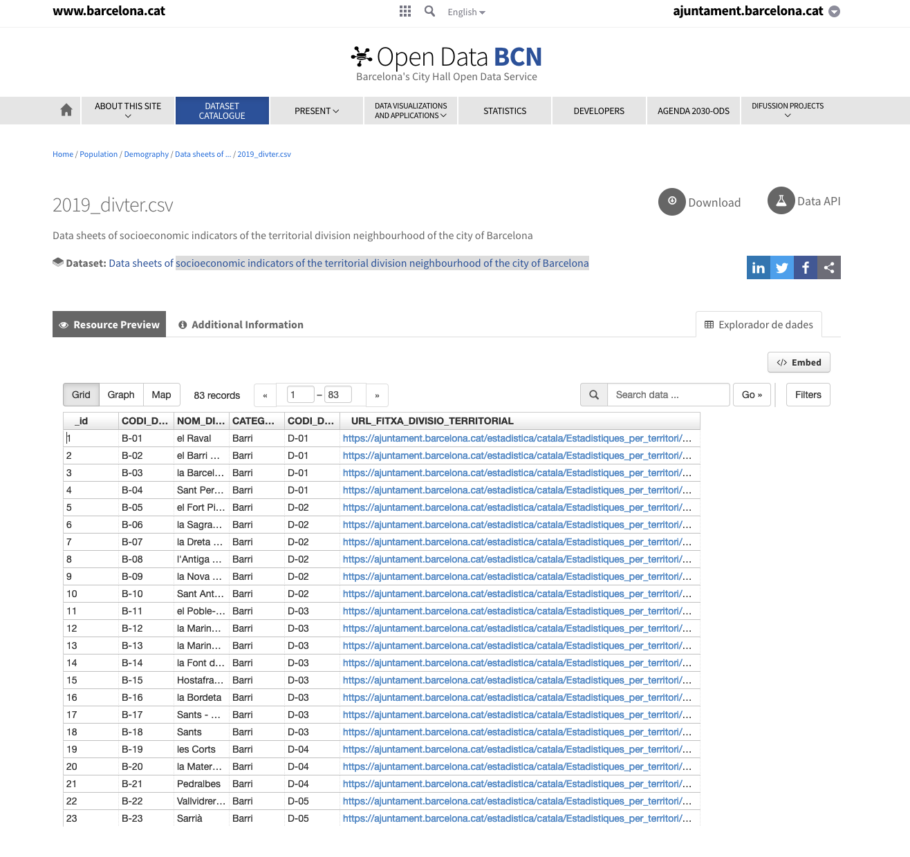
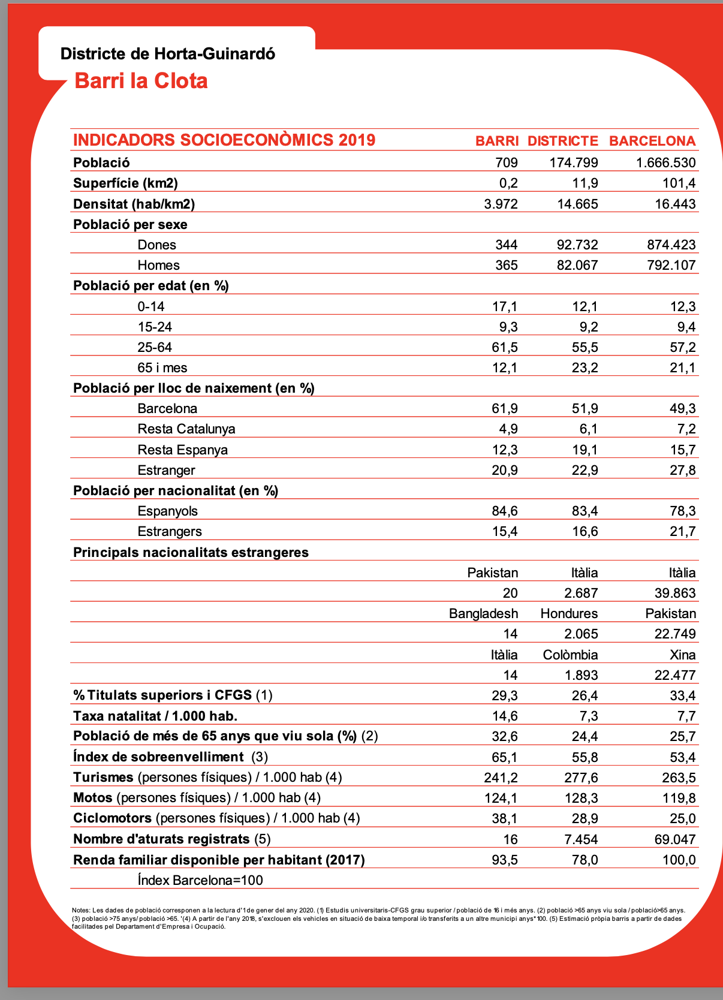

# Project: socioeconomic indicators of the territorial division of the city of Barcelona

Collecting data from the Barcelona City Hall Open Data Service's  on **socioeconomic indicators of the territorial division** of the city of **Barcelona**.

Here we are going to do:

+ webscraping
+ download cvs and pdf files
+ Extracting information from pdf files using regular expressions
+ and create a database with the information obtained.
____

## The starting point
___

Barcelona city council offers an [open data service](https://opendata-ajuntament.barcelona.cat/data/en/dataset/divter/resource/ed515bb8-502b-4dff-96dc-769f72767919).
The website is accessible to any user and the website also offers the possibility of downloading data or accessing the data through an API

For this project we are interested in having access to the data of socioeconomic indicators of the neighborhood territorial division of the city of Barcelona.

This website is an initiative in favor of open data, but it has notable limitations.
_____

## The problem

______

The official portal provides a poor interface for accessing the data, which, however, has great value for open and free access to the data.

1. **Access through a URL**: To obtain the socio-economic information of the neighborhoods, we have to go one by one by clicking on the link provided on the website. This link allows us to download a pdf file with the information we need.

 r

2. **Data cannot be compared**: As the data for each neighborhood are in pdf files there is no way to compare each of the neighborhoods. Besides, there is no table that gathers all this information. 

_____
## The challenge
____

**can we get the information, collect it and organize it in a better way?** 

So that we can then make comparisons and analysis about the different neighborhoods of the city of Barcelona using these socio-economic indicators. 

____
## Steps to follow

_____

+ Webscraping to get the urls
+ obtain the pdf files for each of the neighborhoods
+ Extract indicators from pdf files
+ Create a database with the extracted information
+ Use the database to analyze the socio-economic indicators of the neighborhoods of the city of Barcelona.
